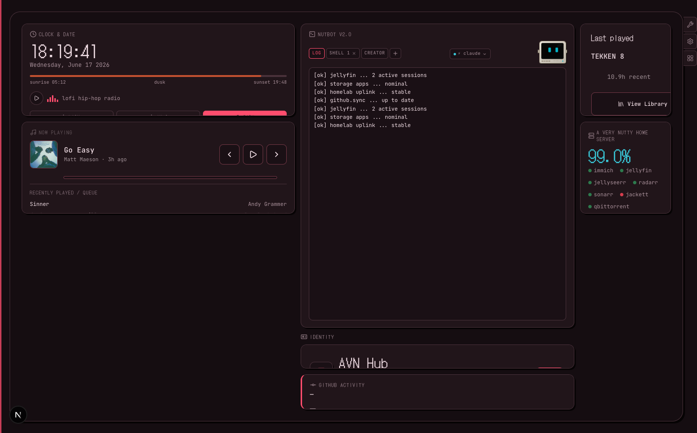
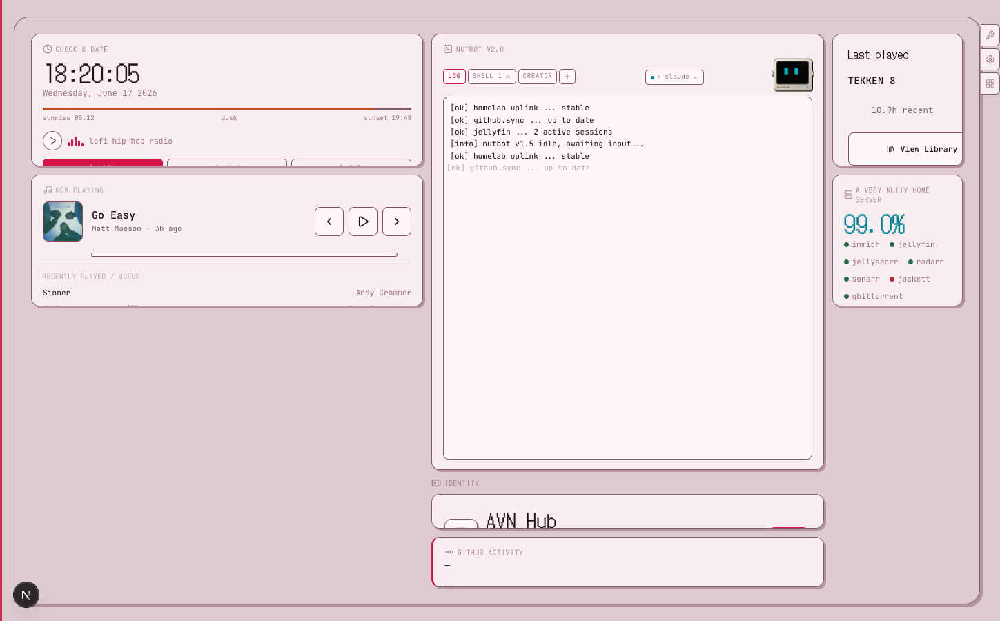
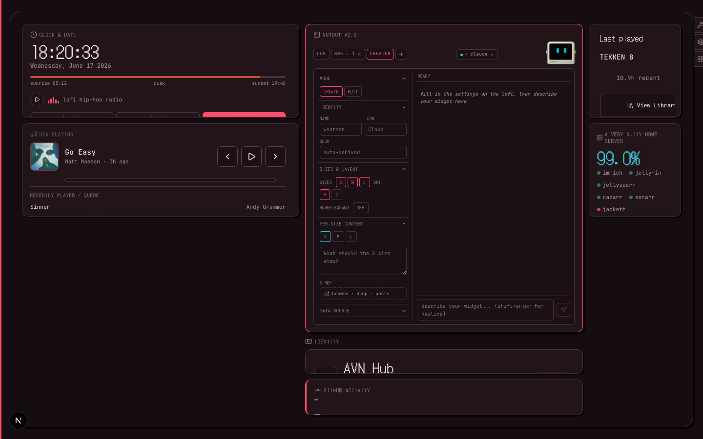
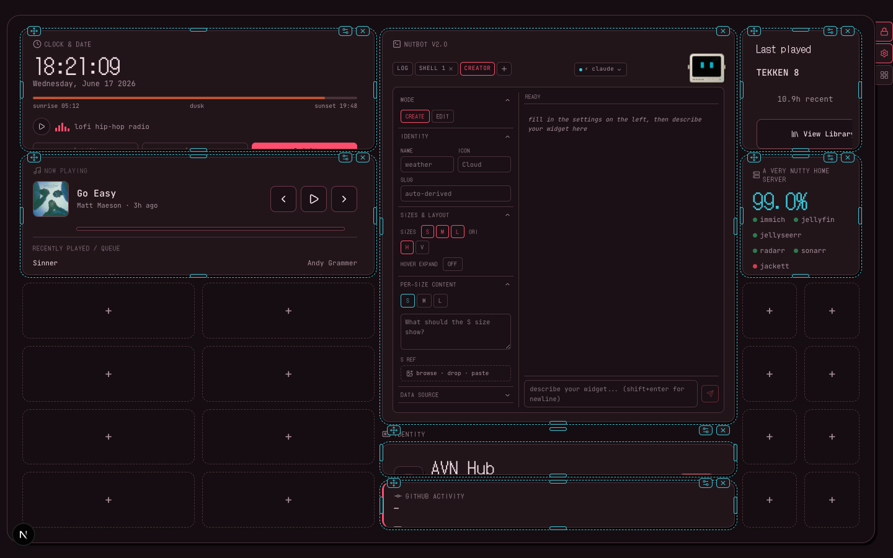
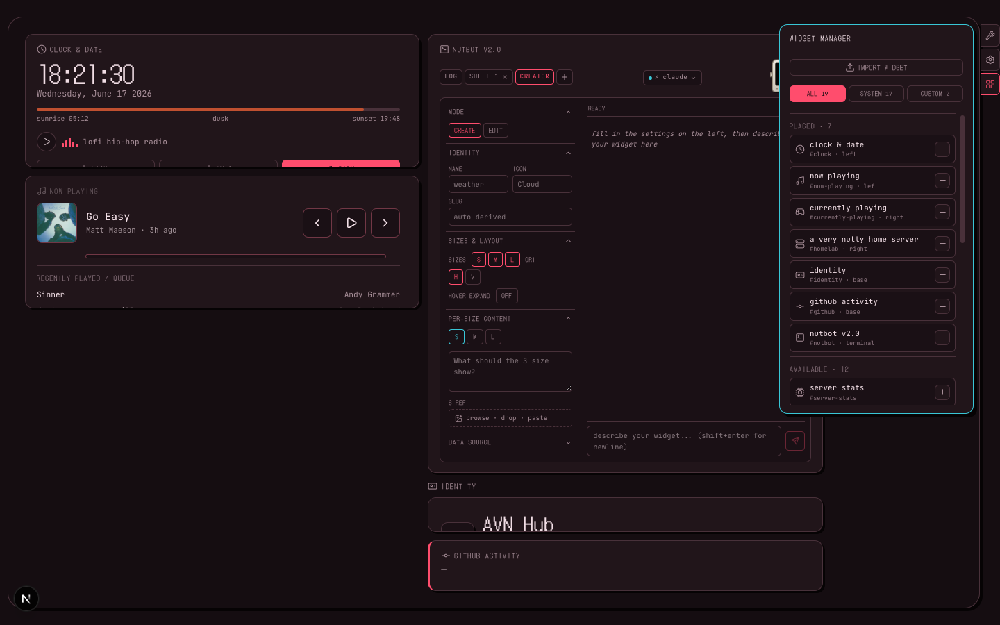
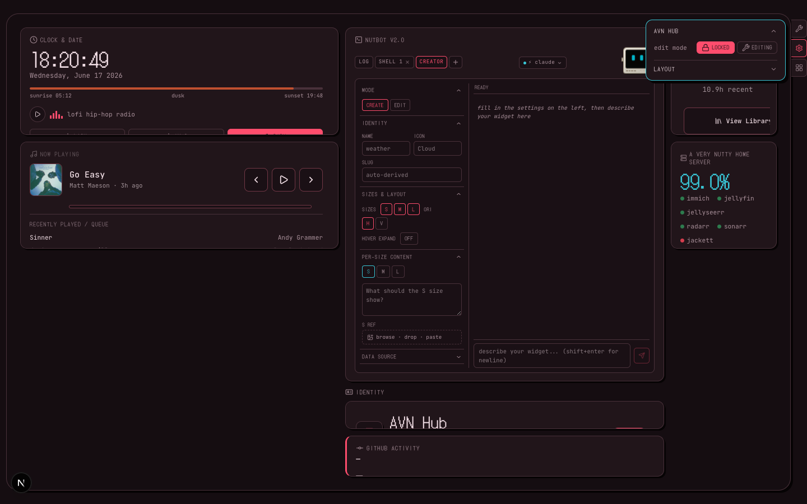

# AVN Hub

> A configurable personal OS for your dashboard — drag, resize, and create widgets with AI.

AVN Hub is a self-hosted living dashboard. It shows what you're listening to, what game you're playing, whether your homelab is alive, your latest commits — all on one page, running on your own hardware, private by default.

---





---

## What it is

Not a portfolio. Not a status page. A personal control surface that reflects your digital life in real time — music, games, homelab, code — laid out exactly how you want it, with widgets you can build yourself just by describing them.

**Built with:** Next.js · Tailwind CSS · Framer Motion · TypeScript  
**Deployed on:** Self-hosted Docker, accessed privately over Tailscale (no public domain needed)

---

## Features

### Live data widgets out of the box

| Widget | What it shows |
| --- | --- |
| **Now Playing** | Spotify track, artist, album art, playback controls, animated EQ bars |
| **Currently Playing** | Steam game, session hours, total hours |
| **Homelab Status** | Per-service uptime dots (immich, jellyfin, sonarr, radarr…) + average uptime % |
| **GitHub Activity** | Most recent commit, repo, relative timestamp |
| **Clock & Date** | Live clock with sunrise/dusk/sunset bar |
| **NutBot v2.0** | SVG robot mascot with idle eye-tracking, expressions, and a full AI widget creator terminal |

---

### NutBot Widget Creator — build widgets by describing them



NutBot's `CREATOR` tab is an in-dashboard AI terminal. Describe a widget, pick sizes and layout options, and NutBot generates the full React component and wires it into the dashboard — no file editing required.

- Powered by your choice of CLI backend: **Claude Code**, **OpenCode**, or **Codex**
- Auto-fallback chain: if one hits a rate limit it hands off to the next
- TypeScript-checked before registration; rolls back automatically on failure
- Created widgets are drag-placeable, resizable, and configurable like any built-in widget

---

### Configurable layout



The dashboard is a three-region slot grid — left column, right column, and a base strip — with NutBot fixed in the center terminal slot. In **edit mode**:

- **Drag** any widget to a new cell with the move handle
- **Resize** by dragging any of the four edge handles
- **Add** widgets from the widget manager into any region that has space
- **Remove** widgets back to the available pool (never deleted)

Lock the layout when done to prevent accidental changes.

---

### Widget Manager



The Widget Manager tab lists every placed widget (with its region) and every available widget waiting to be placed. Custom widgets created by NutBot appear here automatically alongside built-in ones. You can also import a widget exported as a `.zip` from another card.

---

### Hub Core — settings without leaving the page



A fixed control strip in the top-right corner. Always reachable regardless of layout. Three tabs:

- **Wrench/Lock** — toggle edit mode in one click
- **Settings** — edit mode toggle, layout reset, region grid-size controls (rows × cols per region), layout export/import
- **Widget Manager** — add, remove, export, delete custom widgets

---

### Two fully-designed themes, eight palettes

Both dark and light modes are first-class — not an afterthought. Eight colour palettes (ember, slate, moss, plum, reef, raspberry, circuit, graphite) each have complete dark and light variants. Switch from the Hub Settings widget or Hub Core. Persisted to `localStorage`, applied pre-paint so there's never a flash of the wrong theme.

---

### Hover On Expand (HOE)

Enable per-widget via its gear menu. Hover over a widget to see a real-time preview of its expanded content — neighbours contract slightly to make room. Reverts the moment you move away. No layout is saved. Requires a fine-pointer device.

---

## Self-hosting

### Requirements

- Node.js 20+
- Docker + Docker Compose
- A [Tailscale](https://tailscale.com) account (free) for private HTTPS

### 1. Clone & configure

```bash
git clone https://github.com/Zohaib2244/AVN-Hub.git
cd AVN-Hub
cp .env.local.example .env.local   # fill in your API keys
```

### 2. Environment variables

```env
# Spotify (Authorization Code flow)
SPOTIFY_CLIENT_ID=
SPOTIFY_CLIENT_SECRET=
SPOTIFY_REFRESH_TOKEN=

# Steam
STEAM_API_KEY=
STEAM_PROFILE_ID=        # e.g. 76561199044933923

# Homelab
HOMELAB_STATUS_URL=      # your self-hosted /status endpoint

# GitHub (optional — raises rate limit from 60/hr to 5000/hr)
GITHUB_TOKEN=

# Dev only
HOMELAB_MOCK_DATA=true   # serve realistic mock telemetry without a real homelab
```

### 3. Run with Docker

```bash
docker compose up -d --build
```

### 4. Expose over Tailscale (free private HTTPS, no domain purchase)

```bash
tailscale serve https / http://localhost:3000
# → https://avn-hub.<your-tailnet>.ts.net on every device in your tailnet
```

That's it. No reverse proxy, no Let's Encrypt setup, no public DNS.

---

## Adding custom widgets

NutBot's `CREATOR` tab is the intended path. But you can also follow [`docs/CREATING_WIDGETS.md`](docs/CREATING_WIDGETS.md) to write one by hand — the authoring guide is written so any developer (or LLM) can follow it literally.

Every widget is:

```text
components/widgets/custom/<slug>/
  <Name>Widget.tsx   ← React component (named export)
  manifest.json      ← metadata (title, icon, sizes, settings schema)
```

Registration into the dashboard happens automatically after the files are written.

---

## Project structure

```text
app/
  page.tsx              # root — BootSequence + GlyphStrip + SlotDashboard
  layout.tsx            # fonts, pre-paint theme/palette script
  api/                  # proxy routes (Spotify, Steam, homelab, GitHub, widget creator)
components/
  framework/            # widget shell, context, settings popover, error boundary
  widgets/default/      # built-in widgets (nutbot, now-playing, homelab, github…)
  widgets/custom/       # NutBot-generated custom widgets live here
  dashboard/            # SlotDashboard, HubCorePanel, LayoutProvider, etc.
config/
  widgets.tsx           # manifest registry + DEFAULT_ORDER
  themes.ts             # palette metadata
  customRegistry.json   # auto-managed by widget creator
  customComponentMap.tsx
lib/
  slotLayout.ts         # slot layout store
  layout.ts             # widget instance types + graph layout store
  usePolling.ts         # shared per-URL polling cache
  format.ts             # timeAgo, formatDuration, formatMins
  nutbotSignal.ts       # cross-component NutBot expression signalling
styles/
  globals.css           # design tokens, theme packs, grid, card CSS
docs/
  CREATING_WIDGETS.md   # widget authoring guide
```

---

## Persistence

All layout and preference state lives in `localStorage` — no database needed.

| Key | Contents |
| --- | --- |
| `nutmag-slot-layout` | Region dims + widget placements |
| `nutmag-theme` | Theme mode (light / auto / dark) |
| `nutmag-palette` | Active colour palette |
| `nutmag-prefs` | Polling on/off, boot sequence on/off |
| `nutmag-sessions` | Session uptime tracker |

---

## Tech stack

| | |
| --- | --- |
| Framework | Next.js 15 (App Router) |
| Styling | Tailwind CSS + CSS custom properties |
| Animations | Framer Motion |
| Drag & resize | dnd-kit + custom resize handles |
| NutBot face | SVG with RAF animation loop |
| Widget AI | Claude Code / OpenCode / Codex CLI |
| Deployment | Docker + Tailscale |
